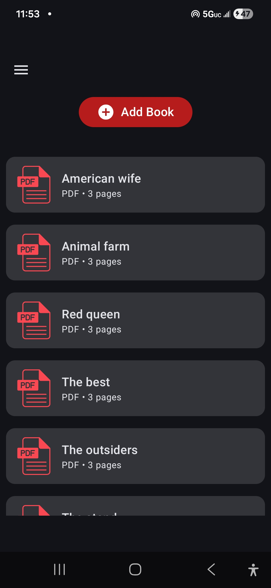
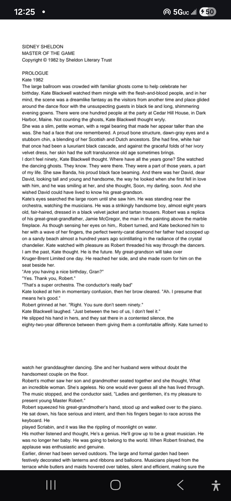

  

<h1 align="center">AI Reader 📚🎵🤖</h1>

  An AI-powered PDF reader that understands the mood of what you read
  and enhances your experience with adaptive background music.

  
  
  

---

## ✨ What is AI Reader?

**AI Reader** is a modern Android PDF reader that goes beyond traditional reading.

When you open a book:

1. 📄 Pages are processed using **ML Kit OCR**
2. 🧠 Extracted text is analyzed by an **LLM (Groq – LLaMA 3.3 70B)**
3. 🎭 The **mood of each page** is detected
4. 🎵 Matching **background music** is played dynamically using the **Jamendo Music API**

The result is a **deeply immersive reading experience**  where the atmosphere of the book adapts as you read.

---

## 🚀 Core Features

- 📄 Open and read PDF files
- 🧠 OCR-based text extraction using ML Kit
- 🎭 Page-level mood analysis via LLM
- 🎵 Dynamic background music matching the mood
- 📚 Library of recently opened books
- 🧭 Clean, modern navigation with Jetpack Compose
- 🎨 Material 3 UI
- ⚡ Smooth performance with Flow & ExoPlayer

---

## 🤖 AI Pipeline (How it Works)

PDF Page  
⬇️  
ML Kit OCR  
⬇️  
Extracted Text  
⬇️  
Groq API (`llama-3.3-70b-versatile`)  
⬇️  
Mood Classification  
⬇️  
Jamendo Music API  
⬇️  
Background Music Playback

---

## 🧠 Planned Features

- 💬 **AI Chat per Book**
    - Chat with the book
    - Ask questions without spoilers
    - Context-aware discussions

- 🌍 Multi-language support
- 🎧 Smarter music transitions
- 💳 API-based feature unlocking

---

## ⚠️ API Status

> **Note:**  
> AI-powered features are temporarily disabled in public builds due to
> API cost constraints.

✔️ Full architecture is implemented  
✔️ APIs are abstracted and ready  
✔️ Can be re-enabled once payment is added

---

## 🛠 Tech Stack

### 📱 Android
- **Kotlin**
- **Jetpack Compose**
- **Navigation Compose**
- **Material 3**
- **MVVM Architecture**
- **StateFlow / Flow**

### 🧠 AI & ML
- **ML Kit OCR**
- **Groq API**
    - Model: `llama-3.3-70b-versatile`

### 🎵 Media
- **Jamendo Music API**
- **Media3 ExoPlayer**

### 🧩 Architecture & Tools
- **Hilt** (Dependency Injection)
- **Room** (Local persistence)
- **Ktor** (Networking)
- **Glide** (Image loading)
- **URI-based file handling**
- **Open APIs**

---

## 🧩 Architecture Overview

UI (Compose)    
⬇️      
ViewModel (StateFlow)   
⬇️  
Repository  
⬇️  
Data Sources (OCR / AI / Music / DB)    

---

## 📸 Screenshots

  
  

---

## 🧑‍💻 Developer

**Ghezae G. Weldemariam**  
Sr Android Engineer | AI-Focused Software Engineer

- LinkedIn: https://linkedIn.com/in/ghezae-g

---

## 📄 License

This project is intended for portfolio, educational,
and demonstration purposes.
